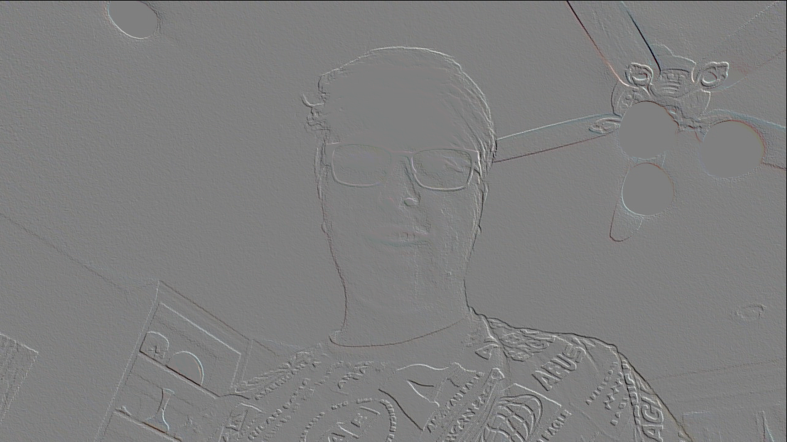

# Pic

I used Python3 and Numba to warp some images. To use the program just edit the `IMNAME` variable at the top of the Python script. Then you can choose an algorithm (OP) and its corresponding scaling algorithm (RESP). `fastDiff` takes three arguments the image as an Numpy array, the x offset and y offset.

## Example Image 
